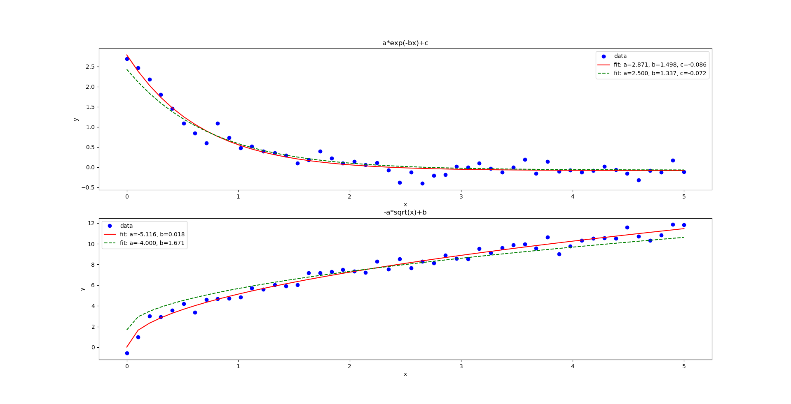

#curve_fit

### Problem
Prezentowanym zaganieniem było znalezienie parametrów funkcji, które jak najlepiej pasuje do danych. W przykładzie zaprezentowano dwie funkcje oraz wygenerowano losowo dane poprzez obliczenie wartości tych funkcji:

```math
ae^{(-bx)} + c
```

```math
-a \sqrt{x} + b
```

przy argumentach od 0 do 5 z krokiem 0.1. Losowość uzyskano poprzez dodanie szumów (wykorzystując pakiet *numpy*).

### Rozwiązanie
Aby rozwiązać zadany problem posłużono się funkcja *curve_fit* z biblioteki *scipy.optimize*, która wykorzystuje nieliniową metodę najmniejszych kwadratów.

Wykorzystano dwa warianty tej funkcji:

```python
curve_fit(f, xdata, ydata, bounds)
```
* f - funkcja, dla której chcemy znaleźć parametry, które najlepiej dopasują ją do danych
* xdata - dane 
* bounds - granice dla parametrów, domyślnie wyłączone

### Wyniki
Ponieżej przedstawiono otrzymane wyniki. Funkcja narysowana na czerwono przedstawia wyliczone parametry funkcji bez sprecyzowania ograniczeń. Zielona to funkcja z ograniczeniami.
* *bounds = (-1, [2.5, 1.5, 0.5])* - ograniczenia dla 1 funkcji, zatem wartości wszystkich parametrów muszą być większe od -1, a mniejsze niż kolejne wartości podane jako drugi argument (dla a<> 2.5, dla b<1.5, a dla c<0.5)
* *bounds=(-4, [-2., 3.])* - ograniczenia dla 2 funkcji


